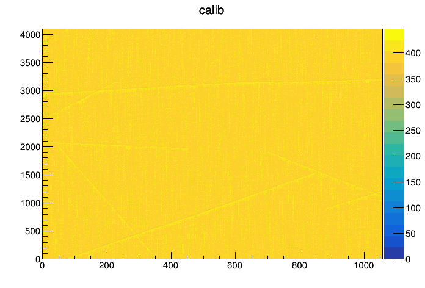

### ICARUS Simulation: Split Wire Geometry

FHiCL files for simulation:

* prod_muon_workshop.fcl |  prodcorsika_standard_icarus.fcl

* cosmics_g4_icarus_volCryostat.fcl

  ```c++
  # explicitly set the split wire geometry 
  services.Geometry: @local::icarus_split_induction_nooverburden_geometry 
  services.ExptGeoHelperInterface: @local::icarus_split_induction_geometry_helper 
  ```

- multitpc_detsim_icarus.fcl

  ```
  # explicitly set the split wire geometry 
  services.Geometry: @local::icarus_split_induction_nooverburden_geometry 
  services.ExptGeoHelperInterface: @local::icarus_split_induction_geometry_helper 
  # keep signal 
  physics.producers.daq0.SuppressNoSignal: false
  ```

* celltree_icarus.fcl

  ```
  # explicitly set the split wire geometry 
  services.Geometry: @local::icarus_split_induction_nooverburden_geometry 
  services.ExptGeoHelperInterface: @local::icarus_split_induction_geometry_helper 
  ```
  
  
  
* standard output from detsim

  ```
  **TPCID: C:0 T:0
  --Plane: C:0 T:0 P:0, start channel: 0, end channel: 1056
  --Plane: C:0 T:0 P:1, start channel: 2400, end channel: 5463
  --Plane: C:0 T:0 P:2, start channel: 8128, end channel: 11191
  
  **TPCID: C:0 T:1
  --Plane: C:0 T:1 P:0, start channel: 1152, end channel: 2208
  --Plane: C:0 T:1 P:1, start channel: 4937, end channel: 8000
  --Plane: C:0 T:1 P:2, start channel: 10665, end channel: 13728
  
  **TPCID: C:1 T:0
  --Plane: C:1 T:0 P:0, start channel: 27648, end channel: 28704
  --Plane: C:1 T:0 P:1, start channel: 30048, end channel: 33111
  --Plane: C:1 T:0 P:2, start channel: 35776, end channel: 38839
  
  **TPCID: C:1 T:1
  --Plane: C:1 T:1 P:0, start channel: 28800, end channel: 29856
  --Plane: C:1 T:1 P:1, start channel: 32585, end channel: 35648
  --Plane: C:1 T:1 P:2, start channel: 38313, end channel: 41376
  ```

  

It seems that the channels are overlapped between two TPCs in the same cryostat. For example, below are the `RawDigits`  (ticks v.s. channelID) from `daq2` and `daq3`. Instead of starting from 12000ish, `daq1` starts from 1000ish.


Also, the number of channel in each TPC is not consistent.

```
DetSim...... | daq0.......... | ..................... | std::vector<raw::RawDigit>........................................... | 7136
DetSim...... | daq2.......... | ..................... | std::vector<raw::RawDigit>........................................... | 7136
DetSim...... | daq3.......... | ..................... | std::vector<raw::RawDigit>........................................... | 7200
DetSim...... | crtdaq........ | ..................... | std::vector<icarus::crt::CRTData>.................................... | ...0
DetSim...... | daq1.......... | ..................... | std::vector<raw::RawDigit>........................................... | 7200
```

Answers from Tracy and Gianluca:


* corsika comparison: legacy 1D vs. wirecell 2D




There is some minor inconsistency!

#### Result from the single-wire geometry

* standard output from multitpc-detsim-icarus.fcl

  ```
  **TPCID: C:0 T:0
  --Plane: C:0 T:0 P:0, start channel: 0, end channel: 1056
  --Plane: C:0 T:0 P:1, start channel: 1056, end channel: 6656
  --Plane: C:0 T:0 P:2, start channel: 6656, end channel: 12256
  
  **TPCID: C:0 T:1
  --Plane: C:0 T:1 P:0, start channel: 12256, end channel: 13312
  --Plane: C:0 T:1 P:1, start channel: 13312, end channel: 18912
  --Plane: C:0 T:1 P:2, start channel: 18912, end channel: 24512
  
  **TPCID: C:1 T:0
  --Plane: C:1 T:0 P:0, start channel: 24512, end channel: 25568
  --Plane: C:1 T:0 P:1, start channel: 25568, end channel: 31168
  --Plane: C:1 T:0 P:2, start channel: 31168, end channel: 36768
  
  **TPCID: C:1 T:1
  --Plane: C:1 T:1 P:0, start channel: 36768, end channel: 37824
  --Plane: C:1 T:1 P:1, start channel: 37824, end channel: 43424
  --Plane: C:1 T:1 P:2, start channel: 43424, end channel: 49024
  ```


There is no overlap in channel IDs for RawDigits.


Questions: 

* ```
  lar -c dump_icarus_channelmap.fcl
  # explicitly set the split wire geometry 
  services.Geometry: @local::icarus_split_induction_nooverburden_geometry 
  services.ExptGeoHelperInterface: @local::icarus_split_induction_geometry_helper
  ```
  
  

=== classic (multi TPC)
- prodcorsika_standard_icarus.fcl
- standard_g4_icarus.fcl
- multitpc_detsim_icarus.fcl
- reco_icarus_driver_reco_multitpc_gauss.fcl
- reco_icarus_driver_reco_multitpc_raw.fcl
- calorimetry_test_producer.fcl: pandoraGausCryo0, pandoraTrackGausCryo0

=== classic
- prodcorsika_standard_icarus.fcl
- standard_g4_icarus.fcl
- standard_detsim_icarus.fcl
- reco_icarus_driver_reco_gauss.fcl
	* reco_icarus.fcl: comment out gaushitsel, SBNShowerGaus, icarus_reco_mcrecogaus, icaurs_reco_wmc_optical
- calorimetry_test_producer.fcl: pandoraGaus, pandoraTrackGaus

=== wirecell
- prodcorsika_standard_icarus.fcl
- standard_g4_icarus.fcl
- wcls-sim-drift-simchannel.fcl
- wcls-decode-to-sig.fcl
- reco_icarus_driver_reco_gauss.fcl
	* set label for recob::Wire
	* reco_icarus.fcl: comment out gaushitsel, 
- calorimetry_test_producer.fcl: pandoraGaus, pandoraTrackGaus