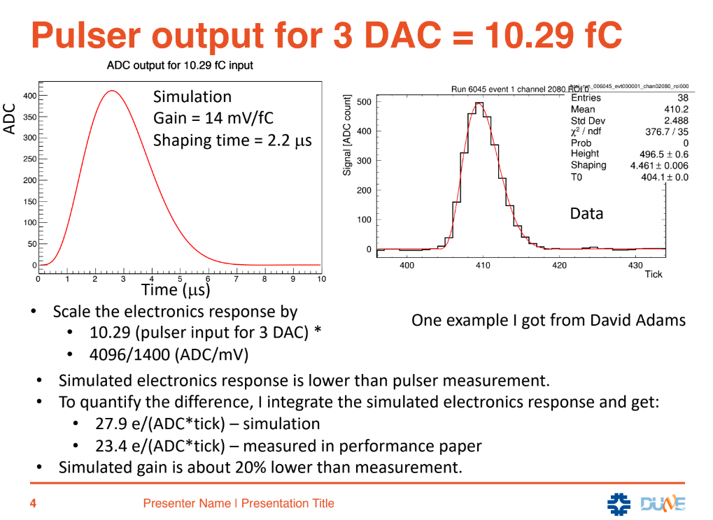

### Scale down ElecResponse

This is proposed by Tingjun given Daivd Adam's calibration. 

It looks that the electronic reponse in data is lower than that in our expectation. The preamplifier is similar to the type used in microboone, so it should be relatively precise. Instead, the ADC gain (1400mV/4095) is thought to have some bias.

One solution is to scale down the ElecResponse in WireCell for both data processing and simulation. After that, one need to validate if it works. So he/she should see that the deconvolved charge becomes larger in data, while it's still about the same for simulation because simulation charge convolution use the same response. 

